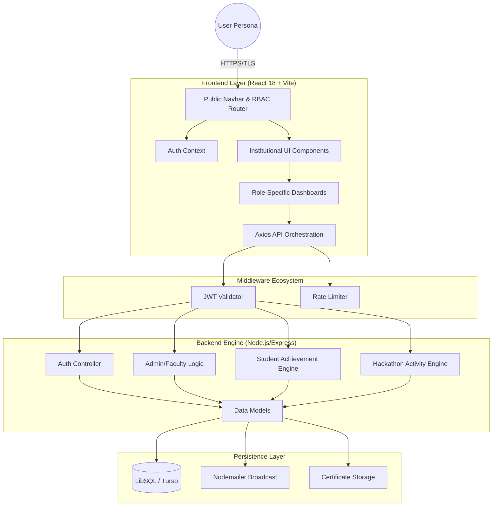
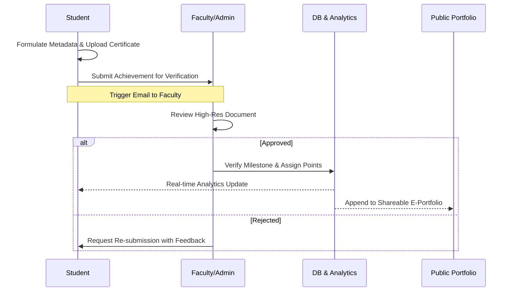

# 🎓 SOEIT Strategic Achievement & Analytics Portal
### *Unified Institutional Excellence Ecosystem for Arka Jain University*

[](https://nodejs.org/)
[](https://vitejs.dev/)
[](https://reactjs.org/)
[](https://turso.tech/)

---

## 🏛️ Institutional Vision

The **SOEIT Achievement Portal** is a high-performance, enterprise-grade digital infrastructure developed for the **School of Engineering & IT (SOEIT)** at Arka Jain University. It serves as the single source of truth for student milestones, faculty oversight, and institutional auditing. Designed with a **Premium Academic Aesthetic**, the platform eliminates administrative friction and replaces legacy tracking with a seamless, data-driven ecosystem.

> [!IMPORTANT]
> **Audit-Ready Infrastructure**: Every transaction and verification cycle is logged for NAAC, NIRF, and internal institutional compliance reporting.

---

## 🏗️ System Architecture

### High-Level Architecture
The portal utilizes a decoupled **REVN** stack (React, Express, Vite, Node) with LibSQL/Turso as the persistence layer.



---

## 🔄 Achievement Lifecycle



---

## 👥 User Personas & Permissions (RBAC)

| Role | Access Level | Primary Responsibility |
| :-- | :-- | :-- |
| **Student** | Learner | Achievement submission, Portfolio management, Hackathon discovery |
| **Faculty** | Overseer | Dept-wide monitoring, Notice broadcasting, Student analytics |
| **Admin** | Validator | Achievement verification, Event management, Hackathon activity tracking |

---

## ✨ Features

### 🎓 Student Features
- **Dashboard** — Real-time stats: total achievements, verified count, pending, points earned
- **Upload Achievement** — Multi-file certificate upload with metadata (level, category, institution, date)
- **My Achievements** — Full history with status badges, filter, search, and edit/delete
- **Live Hackathons Page** — 91+ real upcoming hackathons (2026+) across 13 categories:
  - Govt of India, AI/ML, Web Development, Cybersecurity, Mobile App Dev
  - Web3 & Blockchain, Data Science, Cloud Computing, Hardware & IoT
  - Open Source, Startup, Social Impact, Women in Tech
  - Search by name, filter by category, live count badge
  - Scroll-to-Top button for easy navigation
  - All links are real and verified; activity logged on Apply
- **Public Portfolio** — Shareable profile with achievement cards, stats strip, course progress
- **Course Registry** — Track enrolled courses with progress bars
- **Campus Events** — Browse and track institutional events
- **Student Profile** — Edit bio, LinkedIn, GitHub, portfolio links, profile photo

### 🏫 Faculty Features
- **Faculty Command Center** — Institution-wide student analytics dashboard
- **Scholar Directory** — Filter by semester (1–8) and section (A–G), search by name/enrollment
- **Verification Matrix** — View total, verified, pending achievements per student
- **Export Reports** — Export data to PDF (jsPDF + autoTable) or Excel (XLSX)
- **Dispatch Notice** — Broadcast institutional notices to all students via SMTP email
- **Student Quick View** — Modal summary with achievement analytics per student
- **Full Portfolio Access** — Direct link to any student's public portfolio

### 🔐 Admin Features
- **Admin Dashboard** — Platform-wide charts: achievement trends, domain distribution, verification queue
- **Verify Achievements** — Review and approve/reject uploaded certificates with feedback
- **All Achievements** — Browse every submission across the institution
- **Student Management** — Full student directory with bulk delete support
- **Faculty Management** — Activate/deactivate faculty access, export faculty roster
- **Reports & Analytics** — Deep-dive statistical reports (by department, semester, category, level)
- **Course Monitoring** — Track course enrollment and completion across all students
- **Hackathon Activity Monitor** — Live log of which students clicked which hackathons, with CSV export

### 🌐 Public Pages
- **Landing Page** — Hackathon-style hero, stats strip, feature cards
- **Public Portfolio** — Publicly shareable student achievement page with:
  - Stats: Achievements · Points · **Hackathons Explored** · Courses · Completed
  - Achievement cards with category icons, level badges, verified stamp
  - Course progress cards
  - Category filter (desktop buttons + mobile dropdown)
- **Public Portfolios Directory** — Browse all students by department
- **How It Works**, **Features**, **About**, **Contact** pages

### 🔒 Auth & Security
- JWT-based authentication with auto-routing by role
- CAPTCHA on login form
- Forgot password / reset password via email OTP
- Protected routes with role-based guards
- Logout from any page always redirects to home (`/`)

---

## 🆕 Recent Updates (March 2026)

| Feature | Description |
|---------|-------------|
| 🏆 **91+ Live Hackathons** | 13 categories, 7 per category, all 2026+ real events with verified links |
| 🔍 **Hackathon Search & Filter** | Search by name, filter by type, live hackathon count badge |
| ⬆️ **Scroll to Top** | Smooth scroll-to-top button on the Hackathons page |
| 💻 **Hackathon Activity Tracking** | Backend logs every student's "Apply Now" click; admin can monitor & export |
| 📊 **Portfolio Hackathon Stat** | Public portfolio now shows "Hackathons Explored" count in the stats strip |
| 🎨 **Hackathon Monitoring CSS** | Admin hackathon monitoring page fully restyled with project design system |
| 🎨 **Faculty Management CSS** | Added missing `.table-container` and `.hover-row` styles |
| 🖼️ **Image Error Fallback** | Hackathon card images fall back gracefully to a placeholder on load error |
| 🔁 **Logout → Home** | `AuthContext.logout()` now always redirects to `/` from any page |
| 🔒 **Demo Credentials Hidden** | Removed visible demo credentials box from login page; saved to `demo_credentials.txt` |
| 📐 **Uniform Card Sizes** | Hackathon cards have consistent height, image, title, and footer layout |

---

## 📂 Project Structure

```text
SOEIT-Portal/
├── frontend/                     # Client Interface (React 18 + Vite)
│   ├── src/
│   │   ├── components/
│   │   │   ├── common/           # Sidebar, Navbar, ScrollToTopButton, etc.
│   │   │   └── layout/           # AppLayout, PublicLayout
│   │   ├── context/              # AuthContext (JWT, login, logout, RBAC)
│   │   ├── pages/
│   │   │   ├── auth/             # LoginPage, RegisterPage, ForgotPassword
│   │   │   ├── student/          # Dashboard, Achievements, HackathonsPage
│   │   │   ├── admin/            # AdminDashboard, VerifyAchievements, HackathonMonitoringPage
│   │   │   ├── faculty/          # FacultyDashboard
│   │   │   └── public/           # PublicPortfolioPage, PublicPortfoliosPage
│   │   ├── services/             # api.js — Axios API layer
│   │   └── styles/               # Per-page CSS (vanilla, no Tailwind)
│   └── public/                   # Brand assets
│
├── backend/                      # Core API (Express + LibSQL)
│   ├── controllers/              # achievementController, hackathonController, etc.
│   ├── models/                   # User, Achievement, HackathonActivity, Course, etc.
│   ├── routes/                   # Protected REST endpoints
│   ├── middleware/               # Auth guard, rate limiter, file upload (Multer)
│   └── config/                   # db.js (LibSQL/Turso), environment
│
└── demo_credentials.txt          # 🔐 Dev-only login credentials (not shown in UI)
```

---

## 🚀 Setup & Running

### 1. Environment Variables

**`backend/.env`**
```env
PORT=5000
TURSO_DATABASE_URL=your_turso_db_url
TURSO_AUTH_TOKEN=your_turso_token
JWT_SECRET=your_high_entropy_secret
SMTP_USER=your_email@domain.com
SMTP_PASS=your_app_password
FRONTEND_URL=http://localhost:5173
```

**`frontend/.env`**
```env
VITE_API_URL=http://localhost:5000/api
VITE_UPLOADS_URL=http://localhost:5000
```

### 2. Install & Run

```bash
# Install all dependencies
cd backend && npm install
cd ../frontend && npm install

# Start backend (port 5000)
cd backend && npm run dev

# Start frontend (port 5173)
cd frontend && npm run dev
```

---

## 📈 Strategic Roadmap
- [ ] **AI-driven Validation** — Automated certificate parsing and fraud detection via OCR
- [ ] **Alumni Integration** — Extending achievement lifecycles to SOEIT post-graduates
- [ ] **Institutional Dashboard** — High-level dean's view for department-wide comparisons
- [ ] **Mobile App** — React Native companion for on-the-go achievement submission
- [ ] **Hackathon Registration** — In-app team formation and registration for listed hackathons

---

**Designed & Engineered for the School of Engineering & IT**
*Arka Jain University — Pioneering Technical Education & Student Success*
